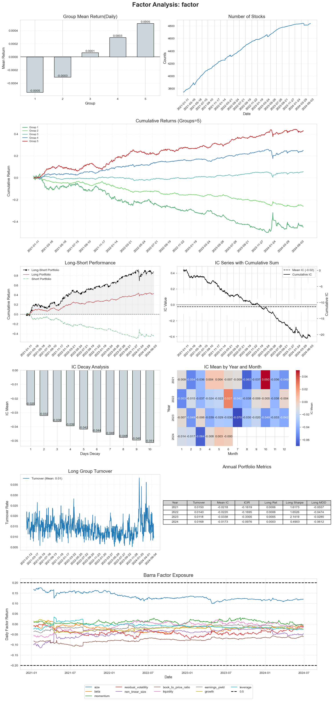

# 股票因子截面分析框架

## Remark:
### 1. 数据来源：
####    目前支持所有A股(剔除ST) 2018.01.01 - 2024.07.01的日频数据（后复权）
####    通过调用函数get_daily_data可以直接获取

### 2. 回测模式选择:
####    ret_mode 有'ret'和'excess_ret'两种选项，分别代表绝对收益和相对票池的超额收益
####    pool有'csi300','csi500','csi1000','market' 四种选项
### 3. 使用示例请见generate_factor.ipynb
